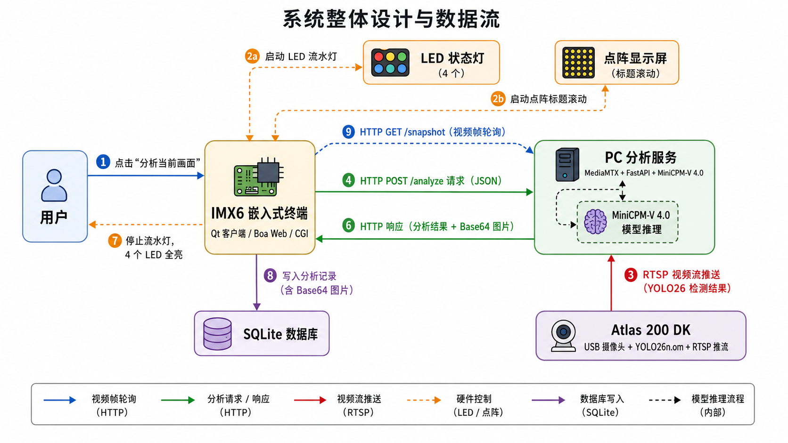

# 基于 IMX6 与 Atlas 200 DK 的嵌入式多模态视觉交互分析系统

本项目实现了一个面向局域网多端协同的嵌入式多模态视觉交互分析系统。系统把 Atlas 200 DK 的端侧目标检测能力、PC 的多模态大模型推理能力、IMX6 实验箱的嵌入式交互与外设控制能力组合起来，完成从摄像头采集、YOLO 目标检测、RTSP 推流、当前帧抓取、MiniCPM-V 图文分析，到 Qt/Web 展示和 SQLite 历史记录保存的完整流程。

项目中的 Atlas 200 DK 端 YOLO26 CANN C++ 推理与部署代码参考：[sc-30-bit/yolo26-cann-cpp](https://github.com/sc-30-bit/yolo26-cann-cpp)。

## 系统概览

系统采用局域网多端协同架构，推荐所有设备接入同一交换机或路由器，并配置为同一网段。



| 设备 | 示例 IP | 角色 | 主要功能 |
| --- | --- | --- | --- |
| Atlas 200 DK | `192.168.137.100` | 边缘视觉节点 | USB 摄像头采集、YOLO26n 检测、结果绘制、RTSP 推流 |
| PC1 | `192.168.137.101` | 流媒体与大模型节点 | MediaMTX、MiniCPM-V-4-int4、FastAPI 分析服务 |
| IMX6 实验箱 | `192.168.137.103` | 嵌入式交互节点 | Qt 客户端、Boa Web、CGI、SQLite、LED/点阵控制 |
| PC2/浏览器 | `192.168.137.105` | Web 访问端 | 通过浏览器访问 IMX6 Web 页面 |

整体数据流：

```text
USB 摄像头
  ↓
Atlas 200 DK
  YOLO26n 目标检测 + 检测框绘制
  ↓ RTSP 推流
PC1 MediaMTX
  ↓ 当前帧读取
PC1 FastAPI + MiniCPM-V-4-int4
  ↓ HTTP JSON
IMX6 Qt / Web
  结果展示 + 历史记录 + LED/点阵状态提示
```

## 仓库结构

```text
.
├── README.md
├── MiniCPM&MediaMTX/
│   ├── app_minicpm.py                         # PC 端 FastAPI + MiniCPM-V 服务
│   ├── requirements.txt                       # Python 依赖
│   ├── README.md                              # PC 端部署说明
│   ├── 项目介绍.md
│   ├── mediamtx_v1.17.1_windows_amd64/        # MediaMTX Windows 版本
│   │   ├── mediamtx.exe
│   │   └── mediamtx.yml
│   └── models/
│       └── MiniCPM-V-4-int4/                  # 本地模型目录，不建议提交到 Git
└── html&qt/
    ├── Makefile                               # IMX6 CGI 交叉编译入口
    ├── activate.sh
    ├── html/
    │   └── index.html                         # IMX6 Web 页面
    ├── cgi-bin/
    │   ├── analyze.cpp                        # Web 端分析请求 CGI
    │   ├── history.cpp                        # 历史记录查询 CGI
    │   ├── dotmatrix.cpp                      # 点阵滚动显示 CGI
    │   ├── db.h                               # SQLite 封装
    │   └── utils.h                            # HTTP/JSON/表单工具函数
    └── imx6_qt_client/
        ├── main.cpp
        ├── mainwindow.cpp
        ├── mainwindow.h
        ├── mainwindow.ui
        └── imx6_qt_client.pro
```

## 功能特性

- Atlas 200 DK 端部署 YOLO26n，完成端侧实时目标检测。
- 检测后画面通过 H.264/RTSP 推送到 PC 端 MediaMTX。
- PC 端 FastAPI 服务从 RTSP 流中抓取当前帧。
- PC 端使用 MiniCPM-V-4-int4 根据图像和提示词生成中文分析结果。
- IMX6 Qt 客户端支持服务测试、当前帧刷新、提示词输入、预设提示词、分析结果和本地历史记录。
- IMX6 Web 端通过 Boa + CGI 调用 PC 分析服务，并把分析记录写入 SQLite。
- IMX6 LED 灯和点阵用于显示系统运行、分析中、完成等状态。

## PC1 部署：MediaMTX + MiniCPM-V + FastAPI

PC1 负责接收 Atlas 的视频流，并对 IMX6 发来的分析请求进行图文推理。

### 环境建议

```text
Windows 10/11
Python 3.10
NVIDIA GPU，实测 RTX 4060 8GB 可运行 int4 版本
PyTorch CUDA
MediaMTX
FastAPI
Transformers
```

安装依赖：

```powershell
cd '.\MiniCPM&MediaMTX'
python -m pip install -r requirements.txt
```

如果使用 conda 环境，把 `python` 替换为对应环境中的解释器即可。

### MiniCPM-V 模型处理

MiniCPM-V-4-int4 权重文件很大，当前本地 `model.safetensors` 约 2.58 GiB，不建议直接提交到普通 Git 仓库。推荐方案：

1. 仓库只保留代码、配置和下载说明。
2. `MiniCPM&MediaMTX/models/` 加入 `.gitignore`，避免误提交权重。
3. 复现时通过 Hugging Face Hub 下载模型到本地目录。
4. 如果课程提交平台允许大文件，可以单独压缩提交或放到网盘/Release，并在 README 写明下载地址。
5. 如果必须由 Git 管理模型，使用 Git LFS，但不建议把 2GB 级模型放进常规课程代码仓库。

下载方式：

```powershell
hf auth login
hf download openbmb/MiniCPM-V-4-int4 --local-dir '.\MiniCPM&MediaMTX\models\MiniCPM-V-4-int4'
```

`app_minicpm.py` 中默认模型路径目前是：

```python
MODEL_PATH = r"E:\github_project\IoT\models\MiniCPM-V-4-int4"
```

在本仓库运行时建议改为当前仓库下的实际路径，例如：

```python
MODEL_PATH = r"E:\github_project\imx6-atlas200-multimodal-vision-system\MiniCPM&MediaMTX\models\MiniCPM-V-4-int4"
```

### 启动 MediaMTX

确认 `MiniCPM&MediaMTX/mediamtx_v1.17.1_windows_amd64/mediamtx.yml` 中包含：

```yaml
paths:
  live:
    source: publisher
```

启动：

```powershell
cd '.\MiniCPM&MediaMTX\mediamtx_v1.17.1_windows_amd64'
.\mediamtx.exe
```

正常情况下日志会显示 RTSP 端口 `8554` 已监听。

### 测试 RTSP

PC 本机可以先用 ffmpeg 推测试流：

```powershell
ffmpeg -re -f lavfi -i testsrc=size=640x480:rate=25 -c:v libx264 -pix_fmt yuv420p -f rtsp rtsp://127.0.0.1:8554/live
```

再用 VLC 或 ffplay 打开：

```text
rtsp://127.0.0.1:8554/live
```

Atlas 推流时应使用 PC1 的局域网 IP：

```text
rtsp://192.168.137.101:8554/live
```

注意 Atlas 端不能使用 `127.0.0.1`，因为它表示 Atlas 自己。

### 启动 FastAPI 服务

`app_minicpm.py` 的关键配置：

```python
USE_RTSP = True
RTSP_URL = "rtsp://127.0.0.1:8554/live"
IMAGE_SIZE = 448
MAX_NEW_TOKENS = 128
```

启动：

```powershell
cd '.\MiniCPM&MediaMTX'
python -m uvicorn app_minicpm:app --host 0.0.0.0 --port 8000
```

接口文档：

```text
http://127.0.0.1:8000/docs
```

主要接口：

| 接口 | 方法 | 说明 |
| --- | --- | --- |
| `/` | GET | 服务状态检测 |
| `/snapshot` | GET | 抓取当前帧，返回 Base64 JPEG |
| `/analyze` | POST | 抓取当前帧并调用 MiniCPM-V 分析 |
| `/analyze_debug` | POST | 调试接口，不添加系统提示词 |

`/analyze` 请求示例：

```json
{
  "prompt": "请判断当前画面中是否有车辆或行人，只输出一句话。",
  "return_image": true
}
```

返回示例：

```json
{
  "status": "ok",
  "result": "当前画面中有车辆和行人，未发现明显异常风险。",
  "cost_time": 8.632,
  "image_base64": "..."
}
```

## Atlas 200 DK 部署说明

Atlas 200 DK 端负责视频采集、YOLO26n 推理、检测框绘制和 RTSP 推流。本仓库不直接内置完整 Atlas 工程，相关实现参考：

- [sc-30-bit/yolo26-cann-cpp](https://github.com/sc-30-bit/yolo26-cann-cpp)

推荐流程：

```text
YOLO26n.pt
  ↓ 导出
YOLO26n.onnx
  ↓ ATC 转换
YOLO26n.om
  ↓ CANN / AscendCL 推理
Atlas 200 DK 实时检测并推流到 PC1
```

静态 AIPP 预处理示例：

```text
aipp_op {
    aipp_mode: static
    input_format: RGB888_U8
    csc_switch: false
    src_image_size_w: 640
    src_image_size_h: 640

    mean_chn_0: 0
    mean_chn_1: 0
    mean_chn_2: 0
    var_reci_chn_0: 0.003921568627
    var_reci_chn_1: 0.003921568627
    var_reci_chn_2: 0.003921568627
}
```

Atlas 端推流目标：

```text
rtsp://192.168.137.101:8554/live
```

调试建议：

1. 先确认 Atlas 能 `ping` 通 PC1。
2. 先启动 PC1 上的 MediaMTX。
3. Atlas 推流后，在 PC1 用 VLC/ffplay 打开 `rtsp://127.0.0.1:8554/live`。
4. 能看到带检测框的视频后，再启动 MiniCPM FastAPI 服务。

## IMX6 Qt 客户端

Qt 客户端位于：

```text
html&qt/imx6_qt_client/
```

主要功能：

- 每秒调用 PC1 的 `/snapshot` 接口刷新当前帧。
- 支持配置 PC1 IP，默认 `192.168.137.101`。
- 支持测试 PC1 服务状态。
- 支持输入自定义提示词。
- 支持“描述、交通、风险、计数”等预设提示词。
- 调用 `/analyze` 获取 MiniCPM-V 分析结果。
- 显示返回图像、结果文本、推理耗时。
- 在 Qt 页面内保留最近分析历史。

Qt 端访问的接口格式：

```text
http://<PC1_IP>:8000/
http://<PC1_IP>:8000/snapshot
http://<PC1_IP>:8000/analyze
```

## IMX6 Web + Boa + CGI + SQLite

Web 端文件位于：

```text
html&qt/html/index.html
html&qt/cgi-bin/
```

CGI 程序：

| 文件 | 生成目标 | 功能 |
| --- | --- | --- |
| `analyze.cpp` | `analyze.cgi` | 接收网页表单，调用 PC1 `/analyze`，控制 LED，写入 SQLite |
| `history.cpp` | `history.cgi` | 查询最近 50 条历史记录并返回 JSON |
| `dotmatrix.cpp` | `dotmatrix.cgi` | 通过 `/dev/mem` 控制点阵滚动显示 |

数据库默认路径：

```text
/mnt/boa/database/analysis.db
```

也可以通过环境变量覆盖：

```text
DB_PATH=/path/to/analysis.db
```

SQLite 表结构由 `db.h` 自动创建：

| 字段 | 类型 | 说明 |
| --- | --- | --- |
| `id` | INTEGER | 自增主键 |
| `ip` | TEXT | PC1 IP 地址 |
| `prompt` | TEXT | 用户提示词 |
| `result` | TEXT | 分析结果或错误信息 |
| `cost_time` | REAL | 分析耗时 |
| `created_at` | TIMESTAMP | 创建时间 |
| `image` | TEXT | Base64 JPEG 当前帧 |

交叉编译 CGI：

```sh
cd 'html&qt'
make
```

Makefile 默认使用：

```text
arm-poky-linux-gnueabi-g++
sqlite3
pthread
```

部署到 IMX6 时，建议目录结构：

```text
/mnt/boa/
├── html/
│   └── index.html
├── cgi-bin/
│   ├── analyze.cgi
│   ├── history.cgi
│   └── dotmatrix.cgi
└── database/
    └── analysis.db
```

Web 页面访问：

```text
http://192.168.137.103/
```

## 推荐启动顺序

1. 配置所有设备在同一网段，确认 Atlas、PC1、IMX6 可以互相 `ping` 通。
2. PC1 启动 MediaMTX，监听 `8554`。
3. Atlas 200 DK 启动 YOLO26n 检测和 RTSP 推流，推到 `rtsp://192.168.137.101:8554/live`。
4. PC1 用 VLC/ffplay 检查 `rtsp://127.0.0.1:8554/live` 是否正常。
5. PC1 启动 `app_minicpm.py`，监听 `0.0.0.0:8000`。
6. IMX6 启动 Qt 客户端或 Boa Web 服务。
7. 在 Qt/Web 中填写 PC1 IP，输入提示词，点击分析。

## 防火墙配置

如果 Atlas 或 IMX6 无法访问 PC1，需要在 Windows 防火墙中放行：

```powershell
netsh advfirewall firewall add rule name="MediaMTX RTSP 8554" dir=in action=allow protocol=TCP localport=8554
netsh advfirewall firewall add rule name="MiniCPM FastAPI 8000" dir=in action=allow protocol=TCP localport=8000
```

## 常见问题

### MiniCPM 模型是否要提交到仓库？

不建议。`MiniCPM-V-4-int4` 权重超过 2GB，普通 Git 仓库不适合保存这类文件。正确做法是：

- README 写清下载命令和目标目录。
- `.gitignore` 忽略 `MiniCPM&MediaMTX/models/`。
- 提交代码时不要 `git add` 模型权重。
- 需要验收时，使用外部下载链接、网盘、GitHub Release 或 Git LFS 单独提供。

### FastAPI 打开 RTSP 失败

先确认 MediaMTX 正在运行，并用 VLC/ffplay 打开：

```text
rtsp://127.0.0.1:8554/live
```

如果 PC1 本机都无法播放，问题在 Atlas 推流或 MediaMTX；如果本机能播放但 IMX6 调用失败，重点检查 PC1 防火墙和 IP。

### Atlas 推流地址怎么写？

Atlas 推流必须写 PC1 的局域网 IP：

```text
rtsp://192.168.137.101:8554/live
```

不要写 `127.0.0.1`。

### IMX6 Web 能打开但分析失败

检查：

- Web 页面中的 PC IP 是否正确。
- PC1 的 `8000` 端口是否放行。
- PC1 的 FastAPI 是否已经加载完模型。
- `analyze.cgi` 是否有执行权限。
- `/mnt/boa/database/` 是否可写。

## 当前实现状态

- PC 端 MiniCPM-V FastAPI 服务已实现。
- PC 端 MediaMTX 配置已放入仓库。
- IMX6 Qt 客户端已实现当前帧刷新、分析请求和历史显示。
- IMX6 Web 页面、CGI、SQLite 历史记录已实现。
- LED 流水灯与点阵显示控制代码已实现。
- Atlas 200 DK YOLO26 CANN C++ 端代码按外部参考工程集成。

## 技术栈

- 嵌入式平台：IMX6 实验箱、Atlas 200 DK
- 边缘 AI：YOLO26n、CANN、ATC、AscendCL、AIPP
- 多模态模型：MiniCPM-V-4-int4、PyTorch、Transformers
- 视频流：RTSP、MediaMTX、OpenCV、FFmpeg/GStreamer
- 后端服务：FastAPI、Uvicorn
- 嵌入式交互：Qt、Boa、CGI、SQLite
- 外设控制：LED、点阵、`/dev/ledtest`、`/dev/mem`

## 课程说明

本项目为 HIT 嵌入式/物联网/计算机系统设计相关课程设计项目，用于展示多设备网络通信、边缘视觉推理、多模态大模型分析和嵌入式交互控制的综合实现。
